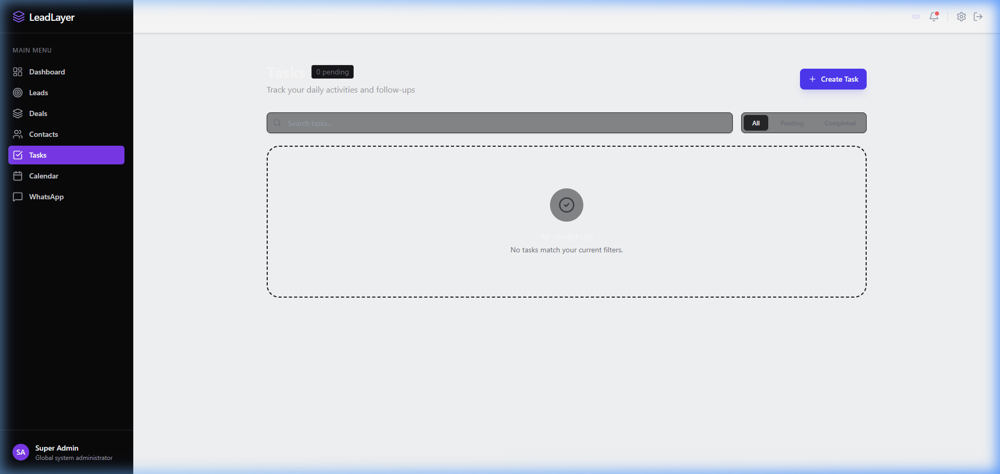
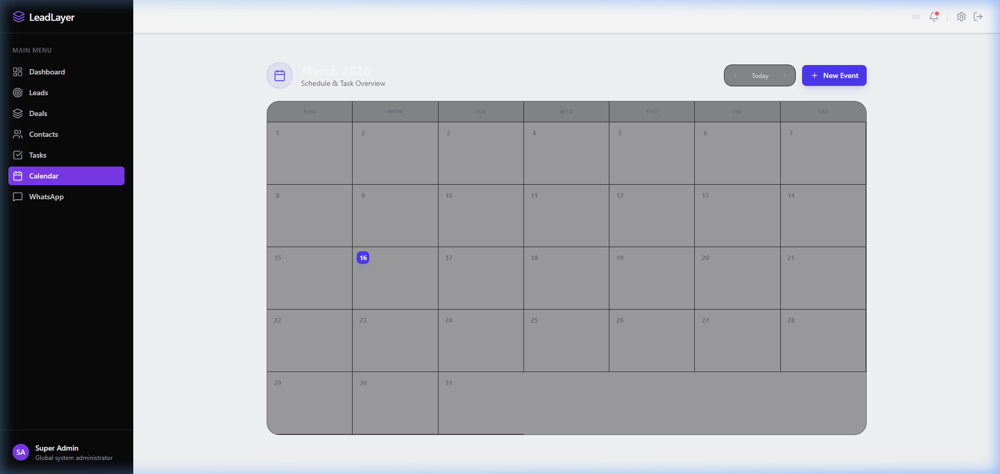

# LeadLayer CRM 🚀

**LeadLayer** is a high-performance, modern CRM designed for scale. Built with a premium "Glassmorphism" aesthetic and a robust multi-tenant architecture, it provides all the tools necessary to manage leads, deals, contacts, and accounts efficiently.

---

## ✨ Key Features

### 🏢 Multi-Tenant Architecture
- Seamless workspace isolation for different organizations.
- Secure data partitioning at the database level.
- Custom RBAC (Role-Based Access Control) with granular permissions.

### 📈 Lead & Deal Management
- **Smart Leads**: Track sources, status, and conversion probability.
- **Deals Kanban**: A visual drag-and-drop board for pipeline management.
- **Pipeline Customization**: Configure multiple pipelines with dynamic stages.

### 📅 Productivity Suite
- **Global Tasks**: Manage activities with priorities and due dates.
- **Monthly Calendar**: A high-fidelity grid visualizing events and task deadlines.
- **Entity Linking**: Associate tasks/events directly with Leads, Deals, or Accounts.

#### 📸 Visual Previews

| Tasks Management | Calendar View |
| :---: | :---: |
|  |  |
| *Managing global activities* | *Schedule & Deadlines* |

### 💹 Financials & Invoices
- **Automated Billing**: Generate professional invoices with dynamic line items.
- **Payment Tracking**: Manage payment status from 'Sent' to 'Paid'.
- **Account Linking**: Connect financial records to Contacts and Deals.

### 📣 Marketing Campaigns
- **Email Outreach**: Design and send multi-recipient email campaigns.
- **Engagement Analytics**: Track open rates and click rates in real-time.
- **Audience Segmenting**: Link campaigns to CRM contacts.

### 📊 Advanced Analytics
- **KPI Command Center**: Real-time business metrics at a glance.
- **Pipeline Visualization**: Deep insights into deal velocity and value.
- **Revenue Forecasting**: Historical trends and monthly growth tracking.

#### 📸 Visual Previews

| Tasks Management | Calendar View |
| :---: | :---: |
|  |  |
| *Managing global activities* | *Schedule & Deadlines* |

| Financials Module | Marketing Analytics |
| :---: | :---: |
|  |  |
| *Billing & Payments* | *Outreach Engagement* |

---

## 🛠️ Technology Stack

### Backend (Laravel 12)
- **Framework**: Laravel 12.x (Latest)
- **Authentication**: Laravel Sanctum (SPA stateful authentication)
- **Database**: MySQL / PostgreSQL / SQLite
- **Tools**: PHP Artisan, Pail, Pint

### Frontend (React 19)
- **Framework**: React 19 + Vite 8
- **Styling**: Tailwind CSS 4 (Next-gen utility-first CSS)
- **Components**: Headless UI, Lucide Icons
- **State/Routing**: React Router 7, Axios

---

## 🚀 Getting Started

### Prerequisites
- PHP 8.2+
- Node.js 18+
- Composer
- MySQL or SQLite

### Backend Setup
1. Navigate to the backend directory:
   ```bash
   cd backend
   ```
2. Install dependencies:
   ```bash
   composer install
   ```
3. Setup environment:
   ```bash
   cp .env.example .env
   php artisan key:generate
   ```
4. Run migrations:
   ```bash
   php artisan migrate
   ```
5. Start the server:
   ```bash
   php artisan serve
   ```

### Frontend Setup
1. Navigate to the frontend directory:
   ```bash
   cd frontend
   ```
2. Install dependencies:
   ```bash
   npm install
   ```
3. Start the development server:
   ```bash
   npm run dev
   ```

---

## 📂 Project Structure

```text
├── backend/               # Laravel 12 API
│   ├── app/Controllers    # API logic
│   ├── app/Models         # Database schemas
│   └── routes/api.php     # API Endpoints
├── frontend/              # React 19 App
│   ├── src/pages          # UI Screens (Leads, Deals, Calendar)
│   ├── src/components     # Shared UI Components
│   └── src/services       # API (Axios) configuration
└── README.md              # Project Documentation
```

---

## 🎨 Design Philosophy

LeadLayer CRM prioritizes **Visual Excellence**.
- **Dark Mode First**: A sleek, indigo-focused dark theme.
- **Micro-animations**: Smooth transitions using modern CSS.
- **Glassmorphism**: Translucent panels and vibrant gradients for a premium feel.

---

## 🗺️ Roadmap
- [x] Phase 7: Tasks & Calendar 🚀
- [x] Phase 8: Financials (Invoices & Payments) 💳
- [x] Phase 9: Marketing (Email Campaigns) 📣
- [x] Phase 10: Advanced Analytics & AI Insights 📊
- [x] Phase 11: Final Polish & 100% E2E Verification ✨

---

## 📄 License
This project is licensed under the MIT License.
