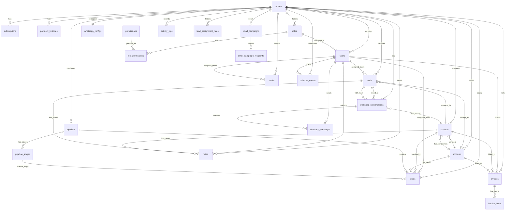
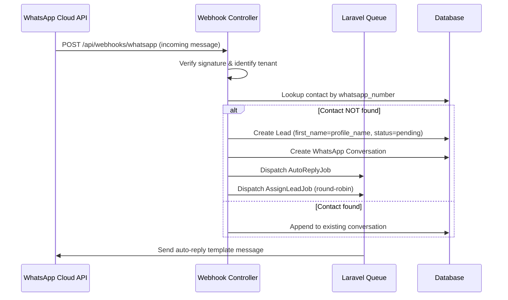

# LeadLayer CRM — Database Schema Map (ERD Outline)

> **Multi-Tenant SaaS CRM** — All tenant-scoped tables use a `tenant_id` foreign key with a composite index for data isolation and query performance.

---

## 1. Multi-Tenancy & Subscription

### `tenants`
| Column | Type | Constraints | Notes |
|---|---|---|---|
| `id` | BIGINT UNSIGNED | PK, AUTO_INCREMENT | |
| `name` | VARCHAR(255) | NOT NULL | Business/Organization name |
| `slug` | VARCHAR(100) | UNIQUE, NOT NULL | URL-safe identifier |
| `domain` | VARCHAR(255) | NULLABLE, UNIQUE | Custom domain (future) |
| `logo_url` | VARCHAR(500) | NULLABLE | Tenant branding |
| `timezone` | VARCHAR(50) | DEFAULT 'UTC' | |
| `subscription_plan` | ENUM('free_trial','starter','professional','enterprise') | DEFAULT 'free_trial' | Active plan tier |
| `subscription_status` | ENUM('active','past_due','cancelled','trialing') | DEFAULT 'trialing' | |
| `trial_ends_at` | TIMESTAMP | NULLABLE | |
| `created_at` | TIMESTAMP | | |
| `updated_at` | TIMESTAMP | | |
| `deleted_at` | TIMESTAMP | NULLABLE | Soft delete |

**Indexes:** `idx_tenants_slug` (slug), `idx_tenants_subscription_status` (subscription_status)

---

### `subscriptions`
| Column | Type | Constraints | Notes |
|---|---|---|---|
| `id` | BIGINT UNSIGNED | PK | |
| `tenant_id` | BIGINT UNSIGNED | FK → tenants.id, UNIQUE | One active subscription per tenant |
| `plan` | ENUM('starter','professional','enterprise') | NOT NULL | |
| `amount` | DECIMAL(10,2) | NOT NULL | Monthly amount in BDT |
| `currency` | VARCHAR(3) | DEFAULT 'BDT' | SSLCommerz uses BDT |
| `status` | ENUM('active','pending','failed','cancelled') | NOT NULL | |
| `sslcommerz_transaction_id` | VARCHAR(255) | NULLABLE | Payment gateway ref |
| `sslcommerz_session_key` | VARCHAR(255) | NULLABLE | |
| `starts_at` | TIMESTAMP | NOT NULL | |
| `ends_at` | TIMESTAMP | NOT NULL | |
| `renewed_at` | TIMESTAMP | NULLABLE | |
| `created_at` | TIMESTAMP | | |
| `updated_at` | TIMESTAMP | | |

**Indexes:** `idx_subscriptions_tenant` (tenant_id), `idx_subscriptions_status` (status)

---

### `payment_histories`
| Column | Type | Constraints | Notes |
|---|---|---|---|
| `id` | BIGINT UNSIGNED | PK | |
| `tenant_id` | BIGINT UNSIGNED | FK → tenants.id | |
| `subscription_id` | BIGINT UNSIGNED | FK → subscriptions.id | |
| `amount` | DECIMAL(10,2) | NOT NULL | |
| `currency` | VARCHAR(3) | DEFAULT 'BDT' | |
| `status` | ENUM('success','failed','refunded') | NOT NULL | |
| `sslcommerz_transaction_id` | VARCHAR(255) | NOT NULL | |
| `sslcommerz_val_id` | VARCHAR(255) | NULLABLE | Validation ID |
| `payment_method` | VARCHAR(50) | NULLABLE | e.g. bKash, card |
| `paid_at` | TIMESTAMP | NULLABLE | |
| `created_at` | TIMESTAMP | | |

**Indexes:** `idx_payment_tenant` (tenant_id), `idx_payment_transaction` (sslcommerz_transaction_id)

---

## 2. Users, Roles & Permissions (RBAC)

### `roles`
| Column | Type | Constraints | Notes |
|---|---|---|---|
| `id` | BIGINT UNSIGNED | PK | |
| `tenant_id` | BIGINT UNSIGNED | FK → tenants.id, NULLABLE | NULL = system-level role (super_admin) |
| `name` | VARCHAR(50) | NOT NULL | e.g. tenant_admin, sales_manager, sales_rep, view_only |
| `display_name` | VARCHAR(100) | NOT NULL | Human-readable |
| `is_system` | BOOLEAN | DEFAULT FALSE | System roles can't be deleted |
| `created_at` | TIMESTAMP | | |
| `updated_at` | TIMESTAMP | | |

**Indexes:** `idx_roles_tenant_name` (tenant_id, name) UNIQUE

### `permissions`
| Column | Type | Constraints | Notes |
|---|---|---|---|
| `id` | BIGINT UNSIGNED | PK | |
| `name` | VARCHAR(100) | UNIQUE, NOT NULL | e.g. leads.view, leads.edit, leads.delete |
| `group` | VARCHAR(50) | NOT NULL | Grouping: leads, contacts, deals, etc. |
| `description` | VARCHAR(255) | NULLABLE | |

### `role_permissions` (Pivot)
| Column | Type | Constraints |
|---|---|---|
| `role_id` | BIGINT UNSIGNED | FK → roles.id |
| `permission_id` | BIGINT UNSIGNED | FK → permissions.id |

**Indexes:** PRIMARY (role_id, permission_id)

### `users`
| Column | Type | Constraints | Notes |
|---|---|---|---|
| `id` | BIGINT UNSIGNED | PK | |
| `tenant_id` | BIGINT UNSIGNED | FK → tenants.id, NULLABLE | NULL = Super Admin |
| `role_id` | BIGINT UNSIGNED | FK → roles.id | |
| `first_name` | VARCHAR(100) | NOT NULL | |
| `last_name` | VARCHAR(100) | NOT NULL | |
| `email` | VARCHAR(255) | NOT NULL | |
| `email_verified_at` | TIMESTAMP | NULLABLE | |
| `password` | VARCHAR(255) | NOT NULL | Hashed |
| `phone` | VARCHAR(20) | NULLABLE | |
| `avatar_url` | VARCHAR(500) | NULLABLE | |
| `is_active` | BOOLEAN | DEFAULT TRUE | |
| `last_login_at` | TIMESTAMP | NULLABLE | |
| `google_oauth_token` | TEXT | NULLABLE | Encrypted, for Google Workspace |
| `google_refresh_token` | TEXT | NULLABLE | Encrypted |
| `remember_token` | VARCHAR(100) | NULLABLE | |
| `created_at` | TIMESTAMP | | |
| `updated_at` | TIMESTAMP | | |
| `deleted_at` | TIMESTAMP | NULLABLE | Soft delete |

**Indexes:** `idx_users_tenant_email` (tenant_id, email) UNIQUE, `idx_users_role` (role_id), `idx_users_active` (tenant_id, is_active)

---

## 3. Leads, Contacts & Accounts

### `accounts` (Companies/Organizations)
| Column | Type | Constraints | Notes |
|---|---|---|---|
| `id` | BIGINT UNSIGNED | PK | |
| `tenant_id` | BIGINT UNSIGNED | FK → tenants.id | |
| `name` | VARCHAR(255) | NOT NULL | Company name |
| `industry` | VARCHAR(100) | NULLABLE | |
| `website` | VARCHAR(500) | NULLABLE | |
| `phone` | VARCHAR(20) | NULLABLE | |
| `email` | VARCHAR(255) | NULLABLE | |
| `address_line_1` | VARCHAR(255) | NULLABLE | |
| `address_line_2` | VARCHAR(255) | NULLABLE | |
| `city` | VARCHAR(100) | NULLABLE | |
| `state` | VARCHAR(100) | NULLABLE | |
| `country` | VARCHAR(100) | NULLABLE | |
| `postal_code` | VARCHAR(20) | NULLABLE | |
| `owner_id` | BIGINT UNSIGNED | FK → users.id, NULLABLE | Assigned account owner |
| `created_at` | TIMESTAMP | | |
| `updated_at` | TIMESTAMP | | |
| `deleted_at` | TIMESTAMP | NULLABLE | |

**Indexes:** `idx_accounts_tenant` (tenant_id), `idx_accounts_owner` (tenant_id, owner_id), `idx_accounts_name` (tenant_id, name)

### `contacts`
| Column | Type | Constraints | Notes |
|---|---|---|---|
| `id` | BIGINT UNSIGNED | PK | |
| `tenant_id` | BIGINT UNSIGNED | FK → tenants.id | |
| `account_id` | BIGINT UNSIGNED | FK → accounts.id, NULLABLE | Linked company |
| `first_name` | VARCHAR(100) | NOT NULL | |
| `last_name` | VARCHAR(100) | NULLABLE | |
| `email` | VARCHAR(255) | NULLABLE | |
| `phone` | VARCHAR(20) | NULLABLE | |
| `whatsapp_number` | VARCHAR(20) | NULLABLE | Normalized E.164 |
| `job_title` | VARCHAR(100) | NULLABLE | |
| `owner_id` | BIGINT UNSIGNED | FK → users.id, NULLABLE | |
| `source` | ENUM('manual','whatsapp','web_form','import','referral','email','other') | DEFAULT 'manual' | |
| `created_at` | TIMESTAMP | | |
| `updated_at` | TIMESTAMP | | |
| `deleted_at` | TIMESTAMP | NULLABLE | |

**Indexes:** `idx_contacts_tenant` (tenant_id), `idx_contacts_account` (tenant_id, account_id), `idx_contacts_whatsapp` (tenant_id, whatsapp_number), `idx_contacts_email` (tenant_id, email)

### `leads`
| Column | Type | Constraints | Notes |
|---|---|---|---|
| `id` | BIGINT UNSIGNED | PK | |
| `tenant_id` | BIGINT UNSIGNED | FK → tenants.id | |
| `contact_id` | BIGINT UNSIGNED | FK → contacts.id, NULLABLE | Linked contact |
| `account_id` | BIGINT UNSIGNED | FK → accounts.id, NULLABLE | Linked company |
| `first_name` | VARCHAR(100) | NOT NULL | WhatsApp profile name or "Unknown" |
| `last_name` | VARCHAR(100) | NULLABLE | |
| `email` | VARCHAR(255) | NULLABLE | |
| `phone` | VARCHAR(20) | NULLABLE | |
| `whatsapp_number` | VARCHAR(20) | NULLABLE | Normalized E.164 format |
| `company_name` | VARCHAR(255) | NULLABLE | Free-text before account link |
| `job_title` | VARCHAR(100) | NULLABLE | |
| `status` | ENUM('pending','new','contacted','qualified','unqualified','converted','lost') | DEFAULT 'new' | WhatsApp auto-creates as 'pending' |
| `source` | ENUM('manual','whatsapp','web_form','import','referral','email_campaign','other') | DEFAULT 'manual' | |
| `lead_score` | INT UNSIGNED | DEFAULT 0 | Algorithm-calculated |
| `score_breakdown` | JSON | NULLABLE | `{"engagement": 20, "completeness": 15, ...}` |
| `assigned_to` | BIGINT UNSIGNED | FK → users.id, NULLABLE | Round-robin assigned sales rep |
| `converted_at` | TIMESTAMP | NULLABLE | When lead → contact/deal |
| `last_activity_at` | TIMESTAMP | NULLABLE | Tracks engagement recency |
| `custom_fields` | JSON | NULLABLE | Industry-agnostic flexibility |
| `created_at` | TIMESTAMP | | |
| `updated_at` | TIMESTAMP | | |
| `deleted_at` | TIMESTAMP | NULLABLE | |

**Indexes:** `idx_leads_tenant` (tenant_id), `idx_leads_status` (tenant_id, status), `idx_leads_assigned` (tenant_id, assigned_to), `idx_leads_whatsapp` (tenant_id, whatsapp_number), `idx_leads_score` (tenant_id, lead_score DESC), `idx_leads_source` (tenant_id, source)

---

## 4. Deal Pipeline Management

### `pipelines`
| Column | Type | Constraints | Notes |
|---|---|---|---|
| `id` | BIGINT UNSIGNED | PK | |
| `tenant_id` | BIGINT UNSIGNED | FK → tenants.id | |
| `name` | VARCHAR(100) | NOT NULL | e.g. "Sales Pipeline", "Enterprise Deals" |
| `is_default` | BOOLEAN | DEFAULT FALSE | |
| `created_at` | TIMESTAMP | | |
| `updated_at` | TIMESTAMP | | |

**Indexes:** `idx_pipelines_tenant` (tenant_id)

### `pipeline_stages`
| Column | Type | Constraints | Notes |
|---|---|---|---|
| `id` | BIGINT UNSIGNED | PK | |
| `pipeline_id` | BIGINT UNSIGNED | FK → pipelines.id, CASCADE | |
| `tenant_id` | BIGINT UNSIGNED | FK → tenants.id | |
| `name` | VARCHAR(100) | NOT NULL | e.g. "Prospecting", "Proposal", "Negotiation" |
| `position` | INT UNSIGNED | NOT NULL | Sort order for Kanban |
| `win_probability` | DECIMAL(5,2) | DEFAULT 0 | % likelihood at this stage |
| `color` | VARCHAR(7) | NULLABLE | Hex color for Kanban card |
| `created_at` | TIMESTAMP | | |
| `updated_at` | TIMESTAMP | | |

**Indexes:** `idx_stages_pipeline` (pipeline_id, position)

### `deals`
| Column | Type | Constraints | Notes |
|---|---|---|---|
| `id` | BIGINT UNSIGNED | PK | |
| `tenant_id` | BIGINT UNSIGNED | FK → tenants.id | |
| `pipeline_id` | BIGINT UNSIGNED | FK → pipelines.id | |
| `stage_id` | BIGINT UNSIGNED | FK → pipeline_stages.id | Current Kanban stage |
| `contact_id` | BIGINT UNSIGNED | FK → contacts.id, NULLABLE | |
| `account_id` | BIGINT UNSIGNED | FK → accounts.id, NULLABLE | |
| `lead_id` | BIGINT UNSIGNED | FK → leads.id, NULLABLE | Originating lead |
| `title` | VARCHAR(255) | NOT NULL | Deal name |
| `value` | DECIMAL(15,2) | DEFAULT 0 | Monetary value |
| `currency` | VARCHAR(3) | DEFAULT 'BDT' | |
| `probability` | DECIMAL(5,2) | NULLABLE | Override or inherited from stage |
| `expected_close_date` | DATE | NULLABLE | |
| `actual_close_date` | DATE | NULLABLE | |
| `status` | ENUM('open','won','lost') | DEFAULT 'open' | |
| `loss_reason` | VARCHAR(255) | NULLABLE | |
| `assigned_to` | BIGINT UNSIGNED | FK → users.id, NULLABLE | |
| `position` | INT UNSIGNED | DEFAULT 0 | Sort within stage (Kanban) |
| `created_at` | TIMESTAMP | | |
| `updated_at` | TIMESTAMP | | |
| `deleted_at` | TIMESTAMP | NULLABLE | |

**Indexes:** `idx_deals_tenant_pipeline` (tenant_id, pipeline_id), `idx_deals_stage` (stage_id, position), `idx_deals_assigned` (tenant_id, assigned_to), `idx_deals_status` (tenant_id, status)

---

## 5. WhatsApp Integration

### `whatsapp_configs`
| Column | Type | Constraints | Notes |
|---|---|---|---|
| `id` | BIGINT UNSIGNED | PK | |
| `tenant_id` | BIGINT UNSIGNED | FK → tenants.id, UNIQUE | One config per tenant |
| `phone_number_id` | VARCHAR(100) | NOT NULL | Meta Phone Number ID |
| `waba_id` | VARCHAR(100) | NOT NULL | WhatsApp Business Account ID |
| `access_token` | TEXT | NOT NULL | Encrypted, long-lived token |
| `webhook_verify_token` | VARCHAR(255) | NOT NULL | For webhook verification |
| `auto_reply_enabled` | BOOLEAN | DEFAULT TRUE | |
| `auto_reply_template` | TEXT | NULLABLE | Customizable first-response message |
| `auto_create_lead` | BOOLEAN | DEFAULT TRUE | Auto-create lead from unknown numbers |
| `is_active` | BOOLEAN | DEFAULT TRUE | |
| `created_at` | TIMESTAMP | | |
| `updated_at` | TIMESTAMP | | |

**Indexes:** `idx_wa_config_tenant` (tenant_id), `idx_wa_config_phone` (phone_number_id)

### `whatsapp_conversations`
| Column | Type | Constraints | Notes |
|---|---|---|---|
| `id` | BIGINT UNSIGNED | PK | |
| `tenant_id` | BIGINT UNSIGNED | FK → tenants.id | |
| `contact_id` | BIGINT UNSIGNED | FK → contacts.id, NULLABLE | |
| `lead_id` | BIGINT UNSIGNED | FK → leads.id, NULLABLE | |
| `wa_contact_number` | VARCHAR(20) | NOT NULL | Remote user's WhatsApp number (E.164) |
| `wa_profile_name` | VARCHAR(255) | NULLABLE | Profile name from WhatsApp |
| `status` | ENUM('active','closed','archived') | DEFAULT 'active' | |
| `last_message_at` | TIMESTAMP | NULLABLE | |
| `assigned_to` | BIGINT UNSIGNED | FK → users.id, NULLABLE | |
| `created_at` | TIMESTAMP | | |
| `updated_at` | TIMESTAMP | | |

**Indexes:** `idx_wa_conv_tenant` (tenant_id), `idx_wa_conv_contact_number` (tenant_id, wa_contact_number), `idx_wa_conv_lead` (tenant_id, lead_id)

### `whatsapp_messages`
| Column | Type | Constraints | Notes |
|---|---|---|---|
| `id` | BIGINT UNSIGNED | PK | |
| `tenant_id` | BIGINT UNSIGNED | FK → tenants.id | |
| `conversation_id` | BIGINT UNSIGNED | FK → whatsapp_conversations.id | |
| `wa_message_id` | VARCHAR(255) | NULLABLE | Meta's message ID |
| `direction` | ENUM('inbound','outbound') | NOT NULL | |
| `message_type` | ENUM('text','image','video','audio','document','template','interactive','reaction','location') | DEFAULT 'text' | |
| `content` | TEXT | NULLABLE | Message body text |
| `media_url` | VARCHAR(500) | NULLABLE | Downloaded media path |
| `media_mime_type` | VARCHAR(100) | NULLABLE | |
| `template_name` | VARCHAR(255) | NULLABLE | If sent via template |
| `status` | ENUM('sent','delivered','read','failed','received') | DEFAULT 'sent' | Delivery status from webhook |
| `error_code` | VARCHAR(50) | NULLABLE | |
| `error_message` | TEXT | NULLABLE | |
| `sent_by` | BIGINT UNSIGNED | FK → users.id, NULLABLE | NULL = system/auto |
| `sent_at` | TIMESTAMP | NULLABLE | |
| `delivered_at` | TIMESTAMP | NULLABLE | |
| `read_at` | TIMESTAMP | NULLABLE | |
| `created_at` | TIMESTAMP | | |

**Indexes:** `idx_wa_msg_conversation` (conversation_id, created_at), `idx_wa_msg_wa_id` (wa_message_id), `idx_wa_msg_tenant` (tenant_id)

---

## 6. Notes System (AI-Upgradable)

### `notes`
| Column | Type | Constraints | Notes |
|---|---|---|---|
| `id` | BIGINT UNSIGNED | PK | |
| `tenant_id` | BIGINT UNSIGNED | FK → tenants.id | |
| `notable_type` | VARCHAR(100) | NOT NULL | Polymorphic: `App\Models\Lead`, `Contact`, `Deal`, `Account` |
| `notable_id` | BIGINT UNSIGNED | NOT NULL | Polymorphic FK |
| `author_id` | BIGINT UNSIGNED | FK → users.id, NULLABLE | NULL = system/AI-generated |
| `type` | ENUM('manual','ai_summary','call_log','system') | DEFAULT 'manual' | Ready for AI integration |
| `title` | VARCHAR(255) | NULLABLE | |
| `content` | TEXT | NOT NULL | Rich text / markdown |
| `ai_model` | VARCHAR(50) | NULLABLE | Future: model used for summary |
| `ai_source_ref` | VARCHAR(255) | NULLABLE | Future: ref to source data |
| `is_pinned` | BOOLEAN | DEFAULT FALSE | |
| `created_at` | TIMESTAMP | | |
| `updated_at` | TIMESTAMP | | |
| `deleted_at` | TIMESTAMP | NULLABLE | |

**Indexes:** `idx_notes_notable` (tenant_id, notable_type, notable_id), `idx_notes_author` (tenant_id, author_id), `idx_notes_type` (tenant_id, type)

> [!TIP]
> The `type` enum and `ai_model`/`ai_source_ref` columns are architected specifically for future AI summary ingestion. Adding a new type like `ai_summary` and populating these fields is all that's needed to integrate AI-generated notes.

---

## 7. Tasks & Calendar

### `tasks`
| Column | Type | Constraints | Notes |
|---|---|---|---|
| `id` | BIGINT UNSIGNED | PK | |
| `tenant_id` | BIGINT UNSIGNED | FK → tenants.id | |
| `taskable_type` | VARCHAR(100) | NULLABLE | Polymorphic link |
| `taskable_id` | BIGINT UNSIGNED | NULLABLE | |
| `title` | VARCHAR(255) | NOT NULL | |
| `description` | TEXT | NULLABLE | |
| `assigned_to` | BIGINT UNSIGNED | FK → users.id, NULLABLE | |
| `created_by` | BIGINT UNSIGNED | FK → users.id | |
| `priority` | ENUM('low','medium','high','urgent') | DEFAULT 'medium' | |
| `status` | ENUM('pending','in_progress','completed','cancelled') | DEFAULT 'pending' | |
| `due_date` | DATETIME | NULLABLE | |
| `completed_at` | TIMESTAMP | NULLABLE | |
| `created_at` | TIMESTAMP | | |
| `updated_at` | TIMESTAMP | | |

**Indexes:** `idx_tasks_tenant_assigned` (tenant_id, assigned_to, status), `idx_tasks_due` (tenant_id, due_date), `idx_tasks_taskable` (tenant_id, taskable_type, taskable_id)

### `calendar_events`
| Column | Type | Constraints | Notes |
|---|---|---|---|
| `id` | BIGINT UNSIGNED | PK | |
| `tenant_id` | BIGINT UNSIGNED | FK → tenants.id | |
| `user_id` | BIGINT UNSIGNED | FK → users.id | Owner |
| `google_event_id` | VARCHAR(255) | NULLABLE | For two-way sync |
| `google_calendar_id` | VARCHAR(255) | NULLABLE | |
| `title` | VARCHAR(255) | NOT NULL | |
| `description` | TEXT | NULLABLE | |
| `location` | VARCHAR(255) | NULLABLE | |
| `starts_at` | DATETIME | NOT NULL | |
| `ends_at` | DATETIME | NOT NULL | |
| `is_all_day` | BOOLEAN | DEFAULT FALSE | |
| `recurrence_rule` | VARCHAR(255) | NULLABLE | iCal RRULE |
| `eventable_type` | VARCHAR(100) | NULLABLE | Polymorphic: Lead, Deal, Contact |
| `eventable_id` | BIGINT UNSIGNED | NULLABLE | |
| `sync_status` | ENUM('synced','pending','error','local_only') | DEFAULT 'local_only' | |
| `last_synced_at` | TIMESTAMP | NULLABLE | |
| `created_at` | TIMESTAMP | | |
| `updated_at` | TIMESTAMP | | |

**Indexes:** `idx_cal_tenant_user` (tenant_id, user_id), `idx_cal_google_event` (google_event_id), `idx_cal_dates` (tenant_id, starts_at, ends_at)

---

## 8. Invoicing

### `invoices`
| Column | Type | Constraints | Notes |
|---|---|---|---|
| `id` | BIGINT UNSIGNED | PK | |
| `tenant_id` | BIGINT UNSIGNED | FK → tenants.id | |
| `invoice_number` | VARCHAR(50) | NOT NULL | e.g. INV-2026-0001 |
| `contact_id` | BIGINT UNSIGNED | FK → contacts.id, NULLABLE | |
| `account_id` | BIGINT UNSIGNED | FK → accounts.id, NULLABLE | |
| `deal_id` | BIGINT UNSIGNED | FK → deals.id, NULLABLE | |
| `issued_by` | BIGINT UNSIGNED | FK → users.id | |
| `status` | ENUM('draft','sent','paid','partially_paid','overdue','cancelled','refunded') | DEFAULT 'draft' | |
| `subtotal` | DECIMAL(15,2) | NOT NULL | |
| `tax_rate` | DECIMAL(5,2) | DEFAULT 0 | |
| `tax_amount` | DECIMAL(15,2) | DEFAULT 0 | |
| `discount_amount` | DECIMAL(15,2) | DEFAULT 0 | |
| `total` | DECIMAL(15,2) | NOT NULL | |
| `amount_paid` | DECIMAL(15,2) | DEFAULT 0 | |
| `currency` | VARCHAR(3) | DEFAULT 'BDT' | |
| `issue_date` | DATE | NOT NULL | |
| `due_date` | DATE | NOT NULL | |
| `paid_at` | TIMESTAMP | NULLABLE | |
| `notes` | TEXT | NULLABLE | |
| `pdf_path` | VARCHAR(500) | NULLABLE | Generated PDF storage path |
| `created_at` | TIMESTAMP | | |
| `updated_at` | TIMESTAMP | | |
| `deleted_at` | TIMESTAMP | NULLABLE | |

**Indexes:** `idx_inv_tenant` (tenant_id), `idx_inv_number` (tenant_id, invoice_number) UNIQUE, `idx_inv_status` (tenant_id, status), `idx_inv_contact` (tenant_id, contact_id)

### `invoice_items`
| Column | Type | Constraints | Notes |
|---|---|---|---|
| `id` | BIGINT UNSIGNED | PK | |
| `invoice_id` | BIGINT UNSIGNED | FK → invoices.id, CASCADE | |
| `description` | VARCHAR(500) | NOT NULL | |
| `quantity` | DECIMAL(10,2) | DEFAULT 1 | |
| `unit_price` | DECIMAL(15,2) | NOT NULL | |
| `total` | DECIMAL(15,2) | NOT NULL | quantity × unit_price |
| `created_at` | TIMESTAMP | | |
| `updated_at` | TIMESTAMP | | |

---

## 9. Email Campaigns

### `email_campaigns`
| Column | Type | Constraints | Notes |
|---|---|---|---|
| `id` | BIGINT UNSIGNED | PK | |
| `tenant_id` | BIGINT UNSIGNED | FK → tenants.id | |
| `name` | VARCHAR(255) | NOT NULL | |
| `subject` | VARCHAR(255) | NOT NULL | |
| `body_html` | LONGTEXT | NOT NULL | Email template HTML |
| `from_name` | VARCHAR(100) | NULLABLE | |
| `from_email` | VARCHAR(255) | NULLABLE | |
| `status` | ENUM('draft','scheduled','sending','sent','paused','cancelled') | DEFAULT 'draft' | |
| `scheduled_at` | TIMESTAMP | NULLABLE | |
| `sent_at` | TIMESTAMP | NULLABLE | |
| `total_recipients` | INT UNSIGNED | DEFAULT 0 | |
| `total_sent` | INT UNSIGNED | DEFAULT 0 | |
| `total_opened` | INT UNSIGNED | DEFAULT 0 | |
| `total_clicked` | INT UNSIGNED | DEFAULT 0 | |
| `total_bounced` | INT UNSIGNED | DEFAULT 0 | |
| `created_by` | BIGINT UNSIGNED | FK → users.id | |
| `created_at` | TIMESTAMP | | |
| `updated_at` | TIMESTAMP | | |

**Indexes:** `idx_camp_tenant` (tenant_id), `idx_camp_status` (tenant_id, status)

### `email_campaign_recipients`
| Column | Type | Constraints | Notes |
|---|---|---|---|
| `id` | BIGINT UNSIGNED | PK | |
| `campaign_id` | BIGINT UNSIGNED | FK → email_campaigns.id, CASCADE | |
| `contact_id` | BIGINT UNSIGNED | FK → contacts.id, NULLABLE | |
| `email` | VARCHAR(255) | NOT NULL | |
| `status` | ENUM('pending','sent','delivered','opened','clicked','bounced','unsubscribed') | DEFAULT 'pending' | |
| `sent_at` | TIMESTAMP | NULLABLE | |
| `opened_at` | TIMESTAMP | NULLABLE | |
| `clicked_at` | TIMESTAMP | NULLABLE | |
| `created_at` | TIMESTAMP | | |

**Indexes:** `idx_recip_campaign` (campaign_id), `idx_recip_email` (email)

---

## 10. Activity Log & Lead Routing

### `activity_logs`
| Column | Type | Constraints | Notes |
|---|---|---|---|
| `id` | BIGINT UNSIGNED | PK | |
| `tenant_id` | BIGINT UNSIGNED | FK → tenants.id | |
| `user_id` | BIGINT UNSIGNED | FK → users.id, NULLABLE | |
| `loggable_type` | VARCHAR(100) | NOT NULL | Polymorphic |
| `loggable_id` | BIGINT UNSIGNED | NOT NULL | |
| `action` | VARCHAR(50) | NOT NULL | e.g. created, updated, status_changed, note_added |
| `description` | VARCHAR(500) | NULLABLE | Human-readable description |
| `changes` | JSON | NULLABLE | `{"old": {...}, "new": {...}}` |
| `ip_address` | VARCHAR(45) | NULLABLE | |
| `created_at` | TIMESTAMP | | |

**Indexes:** `idx_activity_tenant` (tenant_id, created_at), `idx_activity_loggable` (tenant_id, loggable_type, loggable_id)

### `lead_assignment_rules`
| Column | Type | Constraints | Notes |
|---|---|---|---|
| `id` | BIGINT UNSIGNED | PK | |
| `tenant_id` | BIGINT UNSIGNED | FK → tenants.id | |
| `strategy` | ENUM('round_robin','load_balanced','manual') | DEFAULT 'round_robin' | |
| `eligible_user_ids` | JSON | NOT NULL | Array of user IDs in rotation |
| `last_assigned_index` | INT UNSIGNED | DEFAULT 0 | Pointer for round-robin |
| `is_active` | BOOLEAN | DEFAULT TRUE | |
| `created_at` | TIMESTAMP | | |
| `updated_at` | TIMESTAMP | | |

**Indexes:** `idx_lar_tenant` (tenant_id)

---

## Entity Relationship Diagram

---

## Key Design Decisions

### Multi-Tenancy Strategy
- **Row-Level Isolation** via `tenant_id` on every tenant-scoped table
- All queries scoped through Laravel Global Scopes or middleware
- Composite indexes `(tenant_id, ...)` on all frequently queried columns

### WhatsApp → Lead Auto-Creation Flow

### Lead Scoring Algorithm Inputs
| Factor | Weight | Example |
|---|---|---|
| Profile completeness | 0-25 | Email +5, phone +5, company +5, title +5, last name +5 |
| Engagement signals | 0-35 | WhatsApp reply +10, email opened +5, link clicked +10, meeting scheduled +10 |
| Recency | 0-20 | Active in 24h +20, 7d +10, 30d +5 |
| Source quality | 0-20 | Referral +20, web form +15, WhatsApp +10, import +5 |
